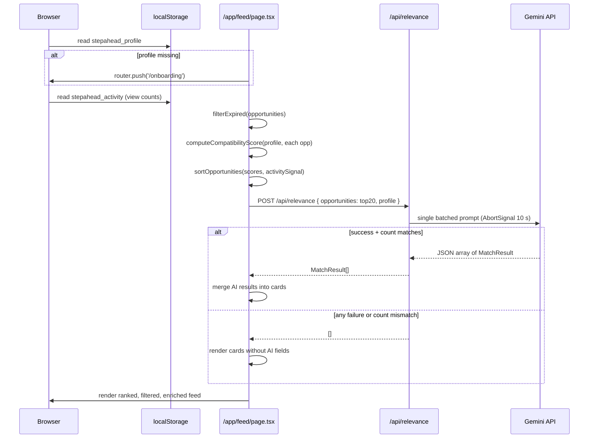
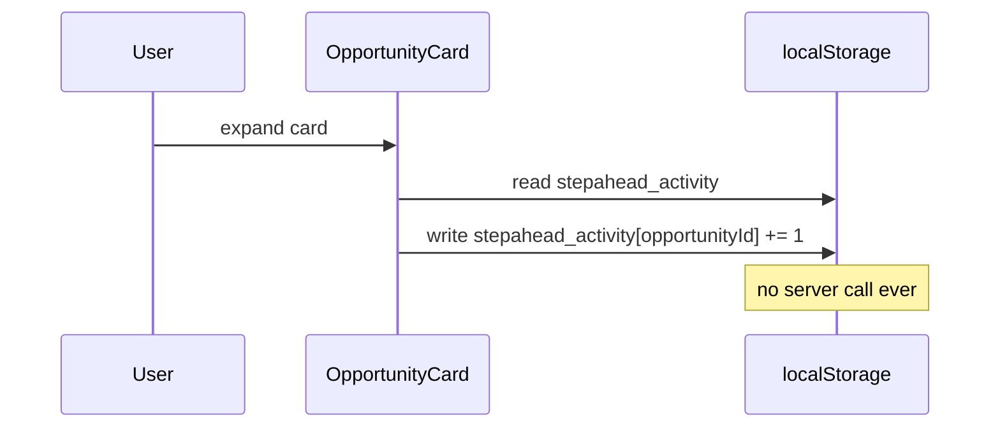

# Design Document — pakistan-location-ai-match

## Overview

This feature delivers two additive capabilities to the StepAhead Next.js 14 application:

1. **Pakistan Location Support** — a canonical `/lib/locations.ts` registry that becomes the single source of truth for every valid location string in the app, including the three new Pakistani tech-hub cities (Lahore, Karachi, Islamabad). All downstream consumers (matching logic, feed filter) import from this one file; the type system enforces that `opportunities.json` values never drift from the registry.

2. **AI Match Score, Summariser & Skill Gap** — a new `/app/api/relevance/route.ts` POST handler that fires a single batched Gemini request per feed load and returns `missingSkills: string[]` and `summary: string` alongside the existing `relevance` and `note` fields. A `localStorage`-only activity signal (view counts) acts as a minor tiebreaker in the feed's secondary sort. A new `/app/feed/page.tsx` renders the ranked, filtered, AI-enriched opportunity cards.

Both deliverables are strictly additive. Three files are locked (`/app/onboarding/page.tsx`, `/app/page.tsx`, `/lib/opportunities.ts`) and must not be touched. The onboarding page derives its location picker dynamically from `opportunities.json` via `useMemo`, so appending Pakistani-location entries to the JSON is enough to surface those cities there.

---

## Architecture

The system follows a simple layered architecture:

```
┌─────────────────────────────────────────────────────────────────┐
│  Browser (client components)                                     │
│                                                                  │
│  /app/feed/page.tsx  (React, "use client")                       │
│   │  reads localStorage: stepahead_profile, stepahead_activity   │
│   │  calls /api/relevance via fetch (POST, one call per load)    │
│   └─ renders ranked + filtered cards with AI enrichment          │
└────────────────────────────┬────────────────────────────────────┘
                             │ HTTP POST /api/relevance
┌────────────────────────────▼────────────────────────────────────┐
│  Next.js Route Handler (server, Node.js runtime)                 │
│                                                                  │
│  /app/api/relevance/route.ts                                     │
│   │  reads process.env.GEMINI_MODEL, GEMINI_API_KEY              │
│   │  sends ONE batched prompt to Gemini                          │
│   └─ returns MatchResult[]  or  []  on any failure               │
└────────────────────────────┬────────────────────────────────────┘
                             │ HTTPS REST
┌────────────────────────────▼────────────────────────────────────┐
│  Google Gemini API  (external)                                   │
└─────────────────────────────────────────────────────────────────┘

Pure utility modules (no I/O, imported by both client and server):
  /lib/locations.ts   — LOCATIONS constant + Location type
  /lib/matching.ts    — computeCompatibilityScore, filterExpired,
                        sortOpportunities
  /types/index.ts     — shared interfaces (Opportunity, StudentProfile,
                        MatchResult)
  /data/opportunities.json — static data, read at build time
```

### Data flow — Feed page load



### Data flow — View count increment



---

## Components and Interfaces

### `/lib/locations.ts`

**Responsibility**: Single source of truth for all valid location strings. Exports a readonly const array and a derived union type. No runtime logic.

```typescript
export const LOCATIONS = [
  "Remote",
  "Lahore",
  "Karachi",
  "Islamabad",
  "Bengaluru",
  "Pune",
  "Chennai",
  "Delhi",
  "Mumbai",
  "Hyderabad",
  "Jaipur",
  "Kolkata",
  "Ahmedabad",
  "Kanpur",
  "London",
  "Singapore",
  "United States (NASA centers)",
] as const;

export type Location = typeof LOCATIONS[number];
```

The `as const` assertion makes `LOCATIONS` a `readonly` tuple of string literals. `Location` is the union of those literals. When `Opportunity.location` is typed as `Location`, any `opportunities.json` entry whose `location` is not in the array causes a TypeScript compile error — requirement 1.6 is enforced at build time without a runtime check.

**Design decision**: the array order is intentional — "Remote" first as the most common filter choice, Pakistani cities second (new entries), then the rest alphabetically. This order is reproduced verbatim in the feed's location filter select.

---

### `/lib/matching.ts`

**Responsibility**: Pure, side-effect-free functions for filtering, scoring, and sorting opportunities.

```typescript
import type { Opportunity, StudentProfile } from "@/types";

export function filterExpired(
  opportunities: Opportunity[],
  now: Date = new Date()
): Opportunity[];

export function computeCompatibilityScore(
  profile: StudentProfile,
  opportunity: Opportunity
): number;

export function sortOpportunities(
  opportunities: Opportunity[],
  profile: StudentProfile,
  activitySignal: Record<string, number>
): Opportunity[];
```

#### `filterExpired`

Removes any opportunity whose `deadline` field, when parsed as `YYYY-MM-DD` at midnight UTC, is strictly before `now`. The `now` parameter is injectable for deterministic testing.

```
deadline < today (UTC midnight) → excluded
deadline >= today               → included
```

#### `computeCompatibilityScore`

Formula (all components clamped so the sum never exceeds 100):

```
skillsComponent    = (profile.skills.length > 0)
                       ? (skillsMatched / profile.skills.length) * 40
                       : 0

interestsComponent = (profile.interests.length > 0)
                       ? (interestsMatched / profile.interests.length) * 30
                       : 0

typeComponent      = profile.preferredTypes.includes(opportunity.category) ? 15 : 0

locationComponent  = (opportunity.location === profile.preferredLocation
                       || opportunity.mode === profile.preferredMode) ? 15 : 0

raw = skillsComponent + interestsComponent + typeComponent + locationComponent

score = Math.round(raw / 5) * 5          // round half-up to nearest 5
score = Math.min(100, Math.max(0, score)) // clamp to [0, 100]
```

- `skillsMatched`: count of strings that appear in both `opportunity.skills` and `profile.skills` (case-sensitive exact match).
- `interestsMatched`: same for `opportunity.interests` vs `profile.interests`.
- Division-by-zero guard: if `profile.skills` or `profile.interests` is empty, that component contributes 0.

#### `sortOpportunities`

Two-key stable sort:
1. **Primary**: `computeCompatibilityScore` descending.
2. **Secondary** (ties only): `activitySignal[opportunity.id] ?? 0` ascending — lower view count ranks higher (unviewed items first).

The sort does not mutate the input array.

---

### `/app/api/relevance/route.ts`

**Responsibility**: Next.js App Router POST handler. Accepts a shortlist of up to 20 opportunities and the student's profile. Makes exactly one Gemini call and returns `MatchResult[]` or `[]`.

```typescript
// POST /api/relevance
// Request body:
{
  opportunities: Opportunity[];   // 1..20 items
  profile: StudentProfile;
}

// Response body (always an array, never a partial):
MatchResult[]   // or []
```

See the [API Design](#api-design-for-apirelevance) section below for full details.

---

### `/app/feed/page.tsx`

**Responsibility**: Client component. Reads `localStorage`, computes scores, fetches AI enrichment, renders ranked cards with location filter.

Key behaviours:
- `"use client"` — all `localStorage` access happens in `useEffect` after mount.
- Redirect to `/onboarding` if `stepahead_profile` is absent.
- Filters expired opportunities before scoring.
- Sends top 20 non-expired opportunities to `/api/relevance`.
- Merges `MatchResult[]` (keyed by `opportunityId`) into card display state.
- Increments `stepahead_activity[opportunityId]` when a card is expanded.
- Location filter is a `<select>` populated from `LOCATIONS`.

---

### `/types/index.ts` (additive change)

The `MatchResult` interface gains two fields:

```typescript
export interface MatchResult {
  opportunityId: string;
  relevance: "Strong" | "Moderate" | "Light";
  note: string;
  missingSkills: string[];   // NEW — empty array if no gaps
  summary: string;           // NEW — max 120 chars
}
```

`Opportunity` and `StudentProfile` are **unchanged**.

---

### `/data/opportunities.json` (append only)

Three new seeded entries appended at the end of the array:

| `id`                        | `location`   | `category`  |
|-----------------------------|--------------|-------------|
| `seeded-pk-lahore-01`       | `"Lahore"`   | `internship`|
| `seeded-pk-karachi-01`      | `"Karachi"`  | `hackathon` |
| `seeded-pk-islamabad-01`    | `"Islamabad"`| `course`    |

All three have `sourceStatus: "seeded"` and `sourceNote: "placeholder — not a real listing"`. All required string fields are non-empty; `skills` and `interests` arrays contain at least one element each. Existing entries are not touched.

---

## Data Models

### localStorage keys

| Key | Type | Description |
|-----|------|-------------|
| `stepahead_profile` | `StudentProfile` (JSON-serialised) | Student's onboarding data. Written by `/app/onboarding/page.tsx`, read by `/app/feed/page.tsx`. Never sent to a server except inside the body of `POST /api/relevance`. |
| `stepahead_activity` | `Record<string, number>` (JSON-serialised) | Per-opportunity view counts. Key is `opportunityId`. Value is a non-negative integer. Never sent to any server. Defaults to `{}` when key is absent. |

### `stepahead_activity` shape

```typescript
// Written / read by /app/feed/page.tsx only
type ActivitySignal = Record<string, number>;

// Safe accessor (handles missing key and localStorage errors)
function getActivitySignal(): ActivitySignal {
  try {
    const raw = localStorage.getItem("stepahead_activity");
    if (!raw) return {};
    const parsed = JSON.parse(raw) as unknown;
    if (typeof parsed !== "object" || parsed === null || Array.isArray(parsed))
      return {};
    return parsed as ActivitySignal;
  } catch {
    return {};
  }
}

// Safe writer
function incrementViewCount(opportunityId: string): void {
  try {
    const signal = getActivitySignal();
    signal[opportunityId] = (signal[opportunityId] ?? 0) + 1;
    localStorage.setItem("stepahead_activity", JSON.stringify(signal));
  } catch {
    // silently ignore — feed continues without activity signal
  }
}
```

---

## API Design for /api/relevance

### Request

```
POST /api/relevance
Content-Type: application/json

{
  "opportunities": [ ...Opportunity[] ],   // max 20
  "profile": { ...StudentProfile }
}
```

### Response (success)

```
HTTP 200
Content-Type: application/json

[ ...MatchResult[] ]
```

### Response (failure / fallback)

```
HTTP 200
Content-Type: application/json

[]
```

The route **always** returns HTTP 200. Callers distinguish success from failure by checking `array.length > 0`. This avoids the feed having to handle HTTP error status codes.

### Gemini prompt design

The prompt is assembled server-side and sent as a single `contents[0].parts[0].text` to the Gemini `generateContent` endpoint. It uses structured output instructions to elicit a JSON array.

**System instruction** (embedded in the user turn because Gemini Flash models use `contents`, not a separate system role):

```
You are a career-matching assistant. Given a student profile and a list of opportunities,
return ONLY a valid JSON array. Do not include markdown fences, explanations, or any text
outside the JSON array.

Each element of the array must correspond to exactly one opportunity (in the same order)
and have this exact shape:
{
  "opportunityId": "<string — copy from input>",
  "relevance": "<Strong | Moderate | Light>",
  "note": "<1–2 sentence plain-text explanation, no markdown>",
  "missingSkills": ["<skill>", ...],
  "summary": "<plain text, max 120 characters, must mention at least one skill or field>"
}

Rules:
- relevance is "Strong" if the student's skills and interests are a close match.
  "Moderate" for partial matches. "Light" for weak or tangential matches.
- missingSkills lists skills that appear in the opportunity's skills array
  but are absent from the student's skills array. Use an empty array if none.
- summary must be ≤ 120 characters and must reference at least one skill
  or field from the opportunity.
- Return exactly <N> elements — one per opportunity. No more, no fewer.
```

**User turn** (dynamically built):

```
Student profile:
<JSON.stringify(profile, null, 2)>

Opportunities (return one result per opportunity in this order):
<JSON.stringify(opportunities.map(o => ({
  id: o.id,
  title: o.title,
  skills: o.skills,
  interests: o.interests,
  category: o.category,
  location: o.location,
})), null, 2)>
```

Only the fields relevant to matching are sent (id, title, skills, interests, category, location) to keep the prompt compact and within token limits.

### Request lifecycle

```
1. Parse and validate request body (opportunities array, profile object)
2. If validation fails → return NextResponse.json([])
3. Build prompt string
4. Create AbortController with 10-second timeout
5. fetch(geminiEndpoint, { signal: controller.signal, ... })
6. If fetch throws (network error, timeout) → return NextResponse.json([])
7. If response.status !== 200 → return NextResponse.json([])
8. response.json() to get Gemini response text
9. Extract text content from candidates[0].content.parts[0].text
10. JSON.parse(text) → parsed array
11. If parsed.length !== opportunities.length → return NextResponse.json([])
12. Validate each element has { opportunityId: string, relevance: ..., note: string,
    missingSkills: string[], summary: string }
13. If any element fails shape check → return NextResponse.json([])
14. return NextResponse.json(validatedArray)
```

The Gemini REST endpoint used:

```
https://generativelanguage.googleapis.com/v1beta/models/${process.env.GEMINI_MODEL}:generateContent?key=${process.env.GEMINI_API_KEY}
```

---

## Correctness Properties

*A property is a characteristic or behavior that should hold true across all valid executions of a system — essentially, a formal statement about what the system should do. Properties serve as the bridge between human-readable specifications and machine-verifiable correctness guarantees.*

### Property 1: Compatibility Score Bounds

*For any* valid `StudentProfile` (at least one skill, at least one interest) and any non-expired `Opportunity`, `computeCompatibilityScore(profile, opportunity)` returns a value `n` such that `0 <= n <= 100`.

**Validates: Requirements 5.2, 5.5**

---

### Property 2: Compatibility Score Monotonicity

*For any* `StudentProfile` and two `Opportunity` records `A` and `B` that are identical in every field except that `A.skills` is a strict superset of `B.skills` relative to `profile.skills`, `computeCompatibilityScore(profile, A)` shall be greater than or equal to `computeCompatibilityScore(profile, B)`.

**Validates: Requirements 5.7**

---

### Property 3: Deadline Exclusion

*For any* `Opportunity` record whose `deadline` (parsed as `YYYY-MM-DD` at midnight UTC) is strictly before today's date, `filterExpired([opportunity])` returns an empty array.

**Validates: Requirements 5.6**

---

### Property 4: AI Response Shape

*For any* non-empty array returned by `/api/relevance`, every element `r` satisfies: `typeof r.opportunityId === "string"`, `["Strong","Moderate","Light"].includes(r.relevance)`, `typeof r.note === "string"`, `Array.isArray(r.missingSkills)` and every element of `r.missingSkills` is a string, `typeof r.summary === "string"` and `r.summary.length > 0` and `r.summary.length <= 120`.

**Validates: Requirements 4.2, 4.3, 4.4**

---

### Property 5: AI Failure Fallback

*For any* error condition during the Gemini call — network error, non-200 HTTP status, JSON parse failure, timeout, or response count mismatch — the array returned by `/api/relevance` has length equal to 0.

**Validates: Requirements 4.5, 4.6**

---

### Property 6: Activity Signal Non-Negative and Monotone

*For any* `opportunityId` and any sequence of increment operations on the activity signal, the stored view count after each operation is greater than or equal to the count before that operation, and is always a non-negative integer. Incrementing from any initial non-negative integer `n` produces exactly `n + 1`.

**Validates: Requirements 7.1, 7.2**

---

### Property 7: Location Registry Completeness and No Duplicates

The `LOCATIONS` array exported from `/lib/locations.ts` contains `"Lahore"`, `"Karachi"`, and `"Islamabad"`. *For all* strings `loc` in `LOCATIONS`, `LOCATIONS.filter(l => l === loc).length === 1` (no element appears more than once).

**Validates: Requirements 1.1, 1.2, 2.1**

---

### Property 8: Score Rounding to Nearest 5

*For all* outputs `n` of `computeCompatibilityScore`, `n === Math.round(n / 5) * 5` — the result is always a multiple of 5 with round-half-up semantics.

**Validates: Requirements 5.4**

---

### Property 9: Score Division-by-Zero Safety

*For any* `StudentProfile` where `profile.skills` is empty or `profile.interests` is empty, `computeCompatibilityScore(profile, opportunity)` returns a value in `[0, 100]` without throwing a runtime error.

**Validates: Requirements 5.3**

---

### Property 10: Sort Stability — Score Primary, View Count Secondary

*For any* list of `Opportunity` records with pre-computed scores and activity signal values, `sortOpportunities` produces a list where: (a) no opportunity appears at a position with a lower index than an opportunity with a strictly higher score, and (b) among opportunities with equal scores, the one with a lower view count appears first.

**Validates: Requirements 6.1, 6.2, 7.3**

---

### Property 11: Location Filter Correctness

*For any* selected location string `L` and any list of `Opportunity` records, applying the location filter returns only records where `opportunity.location === L` (case-sensitive exact match).

**Validates: Requirements 6.8**

---

### Property 12: Pakistani-Hub Entries Are Properly Seeded

*For all* entries in `opportunities.json` whose `location` is `"Lahore"`, `"Karachi"`, or `"Islamabad"`, `sourceStatus === "seeded"` and `sourceNote === "placeholder — not a real listing"`.

**Validates: Requirements 2.2**

---

## Error Handling

| Failure scenario | Where handled | Behaviour |
|-----------------|---------------|-----------|
| `stepahead_profile` absent from localStorage | `/app/feed/page.tsx` on mount | `router.push('/onboarding')` — immediate redirect |
| `stepahead_profile` present but malformed JSON | `/app/feed/page.tsx` on mount | Treat as absent → redirect |
| `stepahead_activity` absent or malformed | Activity signal helpers | Return `{}` (all counts default to 0), no error surfaced |
| `localStorage` unavailable / throws | Both localStorage helpers | `try/catch` returns safe defaults; feed renders with score-only sort |
| Gemini network error or timeout (>10 s) | `/app/api/relevance/route.ts` | `catch` block returns `NextResponse.json([])` |
| Gemini non-200 response | `/app/api/relevance/route.ts` | Returns `NextResponse.json([])` |
| Gemini response is not valid JSON | `/app/api/relevance/route.ts` | `JSON.parse` inside `try/catch` → returns `[]` |
| Gemini response count < submitted count | `/app/api/relevance/route.ts` | Returns `[]` — treats full response as failure |
| Individual MatchResult element fails shape check | `/app/api/relevance/route.ts` | Returns `[]` — no partial results |
| `/api/relevance` call fails from feed client | `/app/feed/page.tsx` | `catch` sets AI results to `[]`; feed renders score-only |
| TypeScript type mismatch in `opportunities.json` | Build time | `tsc --noEmit` fails; `Opportunity.location` typed as `Location` |

The overriding principle: **fail closed on AI data**. The feed is always usable via the deterministic compatibility score. AI enrichment is an additive layer that is either fully present or completely absent for each opportunity card — never partial or fabricated.

---

## Testing Strategy

### Dependencies to add (dev only)

```bash
npm install --save-dev vitest @vitejs/plugin-react fast-check @vitest/coverage-v8
```

Vitest is configured via `vitest.config.ts` at the project root and does not require any existing test infrastructure to be changed.

### Test file layout

```
__tests__/
  locations.test.ts     — Properties 7, 12; LOCATIONS shape tests
  matching.test.ts      — Properties 1, 2, 3, 6, 8, 9, 10, 11
  relevance.test.ts     — Properties 4, 5
```

### Dual testing approach

**Unit (example-based) tests** cover:
- Specific score formula components with known inputs and expected outputs
- Exact rounding boundary cases (e.g., raw=37.5 → 40, raw=42.4 → 40)
- Redirect behaviour when profile is absent
- Feed renders `missingSkills` capped at 5
- Feed shows no AI fields when API returns `[]`
- Location filter option list matches `LOCATIONS` array

**Property-based tests** (fast-check, minimum 100 runs each) cover:
- All 12 properties listed above

### Property-based test configuration

Each property test uses `fc.assert(fc.property(...), { numRuns: 100 })` (fast-check default). Tags follow the format:

```
// Feature: pakistan-location-ai-match, Property N: <property_text>
```

### Test coverage by property

| Property | Test file | fast-check arbitraries used |
|----------|-----------|----------------------------|
| P1 — Score Bounds | `matching.test.ts` | `fc.record` for StudentProfile + Opportunity |
| P2 — Monotonicity | `matching.test.ts` | Two Opportunity records with shared field set, varied skills superset |
| P3 — Deadline Exclusion | `matching.test.ts` | `fc.date` for past dates |
| P4 — AI Response Shape | `relevance.test.ts` | Mock fetch returning synthetic valid Gemini response |
| P5 — AI Failure Fallback | `relevance.test.ts` | `fc.oneof` for different error modes |
| P6 — Activity Signal | `matching.test.ts` | `fc.nat` for initial count + `fc.array(fc.nat({max:10}))` for increment sequence |
| P7 — Location Registry | `locations.test.ts` | Deterministic — no generation needed |
| P8 — Score Rounding | `matching.test.ts` | `fc.record` for profile + opportunity |
| P9 — Division-by-Zero | `matching.test.ts` | `fc.record` with empty skills/interests arrays |
| P10 — Sort Stability | `matching.test.ts` | `fc.array` of Opportunity + activity signal map |
| P11 — Location Filter | `matching.test.ts` | `fc.constantFrom(...LOCATIONS)` + `fc.array` of Opportunity |
| P12 — Pakistani Entries | `locations.test.ts` | Deterministic — reads `opportunities.json` directly |

### Running tests

```bash
# Single run (CI / pre-commit)
npx vitest run

# Watch mode (local development)
npx vitest
```

### What property-based testing does NOT cover

The following are verified by TypeScript compilation (`tsc --noEmit`) rather than runtime tests:

- `LOCATIONS as const` readonly enforcement (req 1.5)
- `Opportunity.location` typed as `Location` — drift from `opportunities.json` is a compile error (req 1.6)
- `MatchResult` interface shape (req 3.1–3.3)
- Locked files untouched (req 8.1–8.3)

The following are verified by code inspection and build output:

- Single Gemini call per feed load (req 4.1, 4.8)
- No hardcoded API key or model name (req 4.7)
- Activity signal never sent to server (req 7.5)
